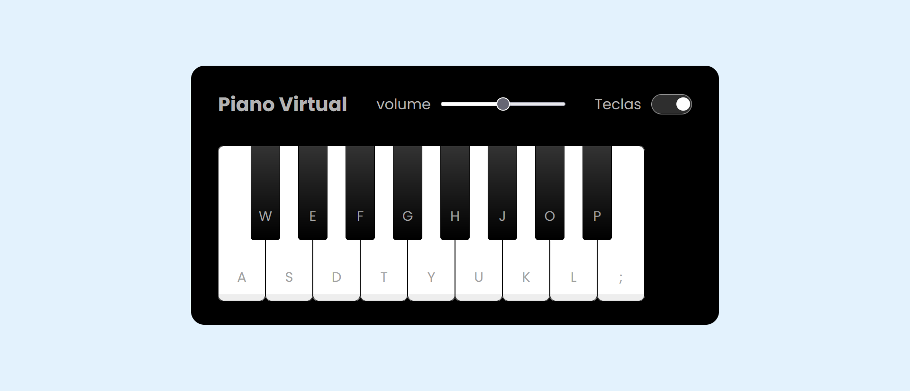

# Piano Virtual 🎹

## 📸 Preview do Projeto

## 📌 Descrição do Projeto
Piano Virtual é uma aplicação web interativa que simula um teclado de piano, permitindo que os usuários toquem música usando o teclado do computador ou clicando nas teclas virtuais.

## 🌟 Funcionalidades
- Reprodução de notas musicais ao clicar ou pressionar teclas
- Controle de volume ajustável
- Opção de mostrar/ocultar as letras das teclas
- Interface simples

## 🚀 Tecnologias Utilizadas
- HTML5
- CSS3
- JavaScript

## ⚙️ Como Executar
1. Clone o repositório
2. Abra o arquivo `index.html` em seu navegador
3. Comece a tocar o piano!

### ⌨️ Teclas Disponíveis
- `a`, `w`, `s`, `e`, `d`, `f`, `t`, `g`, `y`, `h`, `u`, `j`, `k`, `o`, `l`, `p`, `;`

## ⚒️ Recursos
- Slider de volume
- Alternância de visibilidade das teclas
- Efeitos visuais ao pressionar teclas

## 👨‍💻 Autor / Author
Renato ([@RNTrybusy](https://github.com/RNTrybusy))

## Desafio
Projeto desenvolvido durante o desafio "Construindo um Simulador de Piano" da Digital Innovation One (DIO)

## Licença / License
Este projeto está sob a licença MIT - veja o arquivo LICENSE para detalhes.

This project is licensed under the MIT License - see the LICENSE file for details.